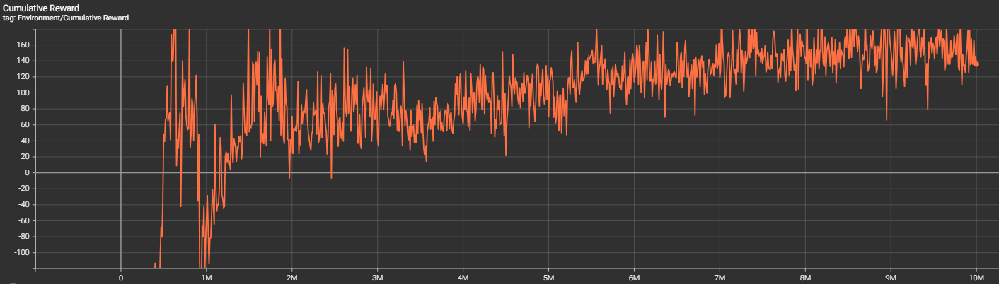
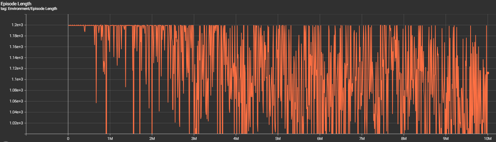
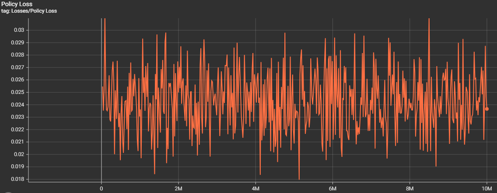
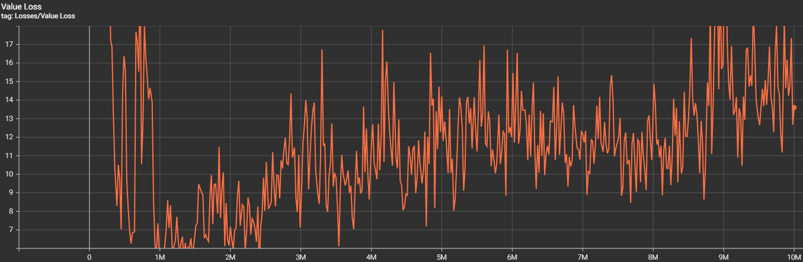

# AI-Powered Naval Combat Training in VR

## Inleiding

Dit project ontwikkelt een virtual reality simulatie waarin AI-agents leren zeeschepen te besturen en tactische zeegevechten uit te voeren. De agents worden getraind met behulp van reinforcement learning om realistisch scheepsgedrag te vertonen, inclusief manoeuvreren, kanonnen richten en strategische positionering. Het systeem combineert Unity's ML-Agents framework met curriculum learning en self-play om progressief complexere zeegevechten aan te leren.

Deze tutorial leidt je door het complete ontwikkelingsproces van het trainen van intelligente scheeps-AI die later kunnen fungeren als uitdagende tegenstanders in een VR piratengame. Tegen het einde kun je zelf AI-agents trainen die realistische zeegevechtstactieken beheersen en kunnen dienen als gevarieerde opponents voor spelers.

## Methoden

### Installatie

Vereiste software versies:
- Unity 6 6000.0.36f1
- mlagents 0.30.0
- Python 3.9.18
- PyTorch 1.7.1

### Simulatie Overzicht

De simulatie bestaat uit meerdere scheeps-agents die opereren in een 3D oceaan-omgeving met variabele grootte (100-400 units). Agents kunnen vrijelijk bewegen, kanonnen richten en op elkaar vuren. Het systeem gebruikt **curriculum learning** om geleidelijk complexiteit toe te voegen (meer agents, obstakels, grotere arena's) en **self-play** waarbij agents tegen elkaar trainen om diverse en uitdagende AI-tegenstanders te ontwikkelen.

### Observaties

De agents observeren:
- **Eigen scheepstoestand**: positie, rotatie vectors, snelheid, genormaliseerde voorwaartse snelheid
- **Kanonnen**: linker/rechter hoeken genormaliseerd, gereedheid status
- **Doelwit informatie**: relatieve positie globaal, relatieve positie lokaal, kanon alignment scores
- **Tactische situatie**: doelwit zijde indicator, afstand genormaliseerd, combat range indicator, approach efficiency

### Acties

**Continue acties** (4):
- Voorwaartse snelheid (0-1, geen achteruit)
- Draaien (-1 tot 1)
- Linker kanon richten (-1 tot 1)
- Rechter kanon richten (-1 tot 1)

**Discrete acties** (2):
- Linker kanon vuren (0/1)
- Rechter kanon vuren (0/1)

### Beloningssysteem

**Positieve beloningen**:
- Tegenstander raken: +5.0 (geschaald door curriculum 0.5x tot 3.0x)
- Vuren: +0.05
- Broadside positionering: +0.02-0.05
- Effectief mikken (ballistische berekeningen): +0.02-0.05 (geschaald door curriculum 2.0x tot 0.05x)
- Combat range handhaving: +0.1 per frame
- Tactische positionering ("Crossing the T"): +0.05

**Negatieve beloningen**:
- Geraakt worden: -0.3
- Obstakels raken: -2.0 (initieel) + -0.5 (continu contact)
- Stilstaan: -0.005 per frame (episode eindigt na 10 seconden stilstand)
- Slechte schoten (grote ballistische fout): -0.1
- Tijd penalty: -0.001 per frame
- Agent botsingen: -1.0
- Te ver uit elkaar (>75 units): -0.01

### Objectbeschrijvingen

**EnemyShipAgent**: Hoofdklasse die ML-Agent gedrag implementeert. Beheert realistische scheepsbeweging met forward-only propulsion, geleidelijke turning acceleration, en drag physics. Implementeert geavanceerde ballistische trajectorieberekeningen voor voorspellend mikken die exact de Unity physics engine nabootsen. Bevat sophisticeerde reward shaping voor tactische positionering.

**CannonballTraining**: Projectiel object dat exacte botsingsdetectie implementeert en rewards toewijst. Neemt scheepssnelheid over bij afvuren en past zwaartekracht toe voor realistische boogtrajecten. Bevat timeout mechanisme (20 seconden) en water impact detection.

**EnvironmentManager**: Dynamische omgevingscontroller die arena grenzen, obstakels en agent activatie beheert volgens curriculum parameters. Zorgt voor smooth transitions tussen curriculum levels zonder episode interruptions.

### Curriculum Learning Configuratie

Het systeem implementeert vier gelijktijdige curriculum dimensies:

1. **Aantal agents**: 2 → 4 → 8 → 12 (complexere multi-agent dynamics)
2. **Obstakels**: 0 → 3 → 5 → 15 → 20 (navigationele uitdagingen)
3. **Arena grootte**: 100 → 150 → 250 → 400 units (schaalbare gevechten)
4. **Reward balancing**: 
   - Aiming rewards: 2.0x → 1.0x → 0.2x → 0.05x (van accuraatheid naar combat focus)
   - Combat rewards: 0.5x → 1.0x → 2.0x → 3.0x (toenemende emphasis op hits)

### Geavanceerde Features

**Ballistische Berekeningen**: Exacte fysica simulatie die rekening houdt met:
- Kanonbal massa en impulse krachten
- Scheeps momentum overdracht
- Zwaartekracht trajecten
- Voorspellende targeting gebaseerd op doelwit snelheid

**Tactische AI Behaviors**:
- Broadside positionering voor optimale kanon deployment
- "Crossing the T" manoeuvres voor tactisch voordeel
- Combat range management (15-50 units optimal)
- Predictive aiming met real-time ballistische compensatie

### Afwijkingen van Oorspronkelijk Plan

- **Toegevoegd**: Geavanceerde ballistische trajectorieberekeningen voor realistische kanonschoten
- **Aangepast**: Van basis movement naar sophisticated naval physics met momentum, drag en realistic turning
- **Uitgebreid**: Multi-dimensionaal curriculum learning met dynamic reward scaling
- **Geïmplementeerd**: Self-play training systeem voor robuuste strategieën

## Resultaten

### Training Voortgang

Deze grafiek toont de gemiddelde cumulatieve reward per episode over de trainingsperiode. In het begin is er een stevige stijging omdat de agents snel leren obstakels en muren te vermijden, wat direct negatieve penalties elimineert. Daarna loopt het redelijk stroef omdat het raken van andere agents met kanonnen niet simpel is - dit vereist het ontwikkelen van complexe vaardigheden zoals voorspellend mikken, ballistische berekeningen en tactische positionering.

Episode lengtes worden gelimiteerd door een maximum van 2 minuten. In de vroege training blijven episodes vaak de volledige 2 minuten duren omdat agents vastlopen tegen muren of obstakels. Naarmate agents betere navigatie ontwikkelen, ontstaat extreme variatie in episode lengtes - sommige episodes eindigen snel wanneer een agent meerdere hits ontvangt, andere duren langer door tactische manoeuvrering en vermijdingsgedrag.

Deze grafieken tonen de convergentie van het PPO algoritme. De policy loss vertoont stabiele horizontale beweging rond 0.018-0.03, wat wijst op consistente gradient updates zonder grote policy wijzigingen. De value loss daalt initieel sterk naarmate het value network leert de reward structuur, maar begint geleidelijk te stijgen wanneer nieuwe curriculum challenges worden geïntroduceerd en de complexiteit van state value estimation toeneemt. De 4-layer, 512-unit netwerken met normalization zorgen voor stabiele learning ondanks curriculum transitions.

### Gedragsobservaties
**Early Training (Episodes 0-300k)**: Agents vertonen chaotisch bewegingsgedrag met frequent botsingen tegen obstakels en elkaar. Willekeurig vuren zonder doelgerichte strategie. Episodes eindigen vaak door stilstand penalties of collision damage. Reward wordt gedomineerd door negatieve penalties voor botsingingen en inefficiënt gedrag.

**Combat Skill Development (Episodes 300k-1M)**: Geleidelijke verbetering in scheepsbesturing en targeting vaardigheden. Agents beginnen elkaar effectiever te raken en ontwikkelen basis begrip van combat range. Minder obstakel botsingingen, meer focus op actual combat.

**Curriculum Escalation (Episodes 1M+)**: Toevoeging van meer agents (8-12) en obstakels (15-20) maakt de arena weer chaotischer ondanks verbeterde individuele vaardigheden. Multi-agent dynamics zorgen voor complexe interactions en onvoorspelbare gevechten. Agents moeten leren navigeren in drukke, gevaarlijke omgevingen.

## Conclusie

Dit project toont een semi-succesvolle implementatie van naval combat AI door middel van multi-dimensionaal curriculum learning en self-play in Unity ML-Agents. Hoewel de agents authentieke scheepsmanoeuvres hebben ontwikkeld en basis gevechtstactieken beheersen, blijven er significante uitdagingen bestaan die de effectiviteit als AI-tegenstanders beperken.

De resultaten demonstreren dat curriculum learning met dynamic reward scaling weliswaar essentieel is voor het leren van multi-dimensionale vaardigheden zoals gelijktijdig navigeren, mikken en tactisch manoeuvreren, maar dat de complexiteit van accurate ballistische berekeningen en voorspellend mikken nog niet volledig wordt beheerst. Ondanks het sophisticated ballistische systeem schieten de agents zelden raak, wat de combat effectiviteit aanzienlijk vermindert.

De training verliep in duidelijke fasen: vroege chaotische bewegingen (0-300k episodes), geleidelijke skill development (300k-1M), en curriculum escalatie waarbij multi-agent dynamics de complexiteit drastisch verhoogden. De policy en value loss convergentie wijzen op stabiele learning, maar de praktische combat performance blijft suboptimaal.

Hoewel de agents authentiek naval combat gedrag vertonen dat als basis kan dienen voor VR pirate game tegenstanders, is verdere ontwikkeling noodzakelijk om werkelijk uitdagende opponents te creëren. Het systeem toont wel het potentieel van modern reinforcement learning, maar benadrukt ook de complexiteit van het ontwikkelen van effectieve AI voor precisie-gebaseerde combat scenarios.

### Toekomstige Verbeteringen

- **Horizontale Kanon Richting**: Uitbreiding van kanon targeting systeem om zowel horizontale (links/rechts) als verticale (omhoog/omlaag) richting te ondersteunen voor meer realistische naval combat
- **AI Persoonlijkheden**: Verschillende agent types (aggressive rammers, tactical snipers, defensive manoeuvrers)
- **Weerscondities**: Wind en golf effecten op movement en ballistics
- **Vloot coördinatie**: Multiple AI ships werken samen tegen de speler
- **Adaptive difficulty**: AI past zich aan aan speler skill level
- **Procedural encounters**: Dynamisch generated combat scenarios
